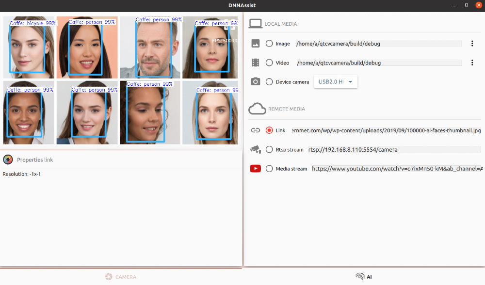

 # DNNAssist! 
 **DNNAssist** is a simple **Qt/Qml** application for testing various **DNN** (deep neural networks) frameworks.  



# IDEA
Load trained model and easy manipulating visual media and parameters of detection while  **WSIWYG** (what you see is what you get) and compare them between various networks. 
##  Choose media
Switch between local media:
 - Image file
 - Movie file 
 - Device camera. 
 > **Note:**  In fact of a unresolved yet bug with media plugin on **linux** is not posible to  switch from camera to RTSP or youtube and switch camera again. It wil be resolved further. At windows works perfectlly.

and network based ones:
 - link to image
 - RTSP stream, i.e. you own IP camera, phone with streaming application, public IP cameras
> **Note:**  there can be additional lag in transmission so live processing can be not reachable.
 - youtube clip
> **Note:** given youtube link is send to external server to resolve exact clip location. Due limitation of API not all clips can be processed. If pasted une is not working, use different one.

## Loading trained models


You can your custom trained models or use pretrained one. Currentlly supported one are:

 - caffe
 - tensorflow
 - yolo

# SUPPORTED FRAMEWORKS & MODELS

 Currentlly dnn processing is done only by [OpenCv](https://opencv.org/). In futher released additional framework will be added (i.e. [Darknet](https://pjreddie.com/darknet/), [OpenVino](https://docs.openvinotoolkit.org/latest/index.html), [Torch](http://torch.ch) and more).
Currentlly supported dnn frameworks models are:

- [Tensorflow](https://github.com/tensorflow/tensorflow), [YOLO](https://pjreddie.com/darknet/yolo/) - supported any custom or pretrained object recognition models also with masks (i.e. MaskRCNN). 
- [Caffe](https://github.com/BVLC/caffe)  - supported any custom or pretrained object recognition models. Masks are not currentlly impelemnted.

Other frameworks and models will be handled in future releases


# HOW TO BUILD
## Build OpenCV for desired platform
- Linux - depends on you hardware build OpenCV with or without GPU support i.e. using this [link](https://cuda-chen.github.io/image%20processing/programming/2020/02/22/build-opencv-dnn-module-with-nvidia-gpu-support-on-ubuntu-1804.html).
- Windows - to build OpenCv with GPU support use **MSCV** for both, **OpenCv** and **DNNAssist**. OpenCv  do **not support  MinGW on windows**.
## Build or install OpenSSL

- Windows - ```https://doc.qt.io/qt-5/windows-requirements.html```
- Linux  - ```sudo apt-get install libssl-dev```


# Open issues:

- Linux: switch from camera again not working, related to g-streamer
- Linux: Rtsp not working, error with gstreamer. https://forum.qt.io/topic/94279/error-while-displaying-gstreamer-video-from-udp-using-qt-multimedia/6

